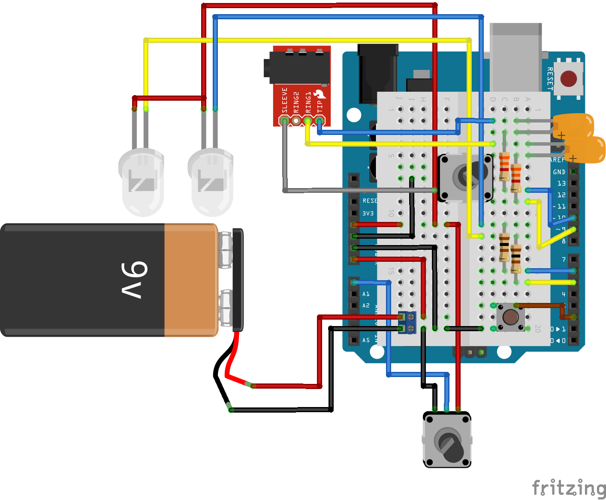

For [usage instructions](https://github.com/thedod/Arduino-Brain-Machine/wiki/How-to-use)
and useful brainwave-entrainment related [links](https://github.com/thedod/Arduino-Brain-Machine/wiki/Related-links),
see [the wiki](https://github.com/thedod/Arduino-Brain-Machine/wiki).

#### Difference from fork's origin:

1. The machine can now run 5 different sessions (including the original one). Excpept for the the original
   session that uses [frequency hopping](https://archive.md/leNZO#selection-1151.0-1151.493) for brainwave entrainment (aka the "chunky" method), the other 4 use smooth frequency transition (aka the "creamy" method), and are based on [Mindplace](https://mindplace.com/) [Proteus](http://mindplacesupport.com/proteus/) sessions (thanks to the admins and members of the mindplace [support forum](http://mindplacesupport.com/forum/) for their cooperation).

1. Pin 2 (that used to be the "wake up button") now has 3 functions (depending on state): start / stop / wake (from sleep mode), and the button's interrupt is always attached (not only during sleep mode).

1. More serial debug prints (note that all serial related code is now
   inside `#ifdef DEBUG` blocks).

**Note:** you should download Bhagman's `Tone` library [here](https://github.com/bhagman/Tone#readme).

#### Example breadboard setup

#### [Photos](https://pixelfed.tokyo/c/89862350668173312)

### Original README.txt

    Repository: Brain Machine for Arduino
    Attribution: Chris Sparnicht - Laughter on Water - http://low.li
    Creation Date: 2011.01.31
    Last Modification Date: 2011.02.15
    License: Creative Commons 2.5 Attrib. & Share Alike
    
    Derivation and Notes:
    Make sure you have dual wheel potentiometer to reduce
    the volume of the audio with your headset. If you don't, 
    you might damage your ear drums, your arduino or your headset.
    Add a 4.7K ohm resistor from each tone pin to each volume-in
    on the potentiometer to further reduce possibility of physical harm.
    
    This arduino sketch is based on the original Sound & Light Machine 
    by - Mitch Altman - 19-Mar-07 as featured in Make Magazine 10.
    http://makezine.com/10/brainwave/
    
    See notes in code below for how I adapted Mitch Altman's version for Arduino
    
    The sleep coding comes partially from here:
    http://www.arduino.cc/playground/Learning/ArduinoSleepCode
    ***************************************************
    2011.02.20
    Fixed error in breadboard diagram. 
    Added new longer show and gamma frequency (40.4Hz).
    
    2011.02.15
    Added liability notice.
    
    2011.02.14
    Changed to switch/case format for stage choices.
    
    2011.02.14
    Added functions for alternating LED blinking for 
    each of the four stages. So now, there are 
    eight cases: b, B, a, A, t, T, d, and D.
    
    2011.02.14
    I've included a Stereo Eyephone Test sketch 
    and a Stereo Tone Test Sketch. These sketches are purely
    for development purposes, used to confirm preferred programming
    prior to putting it into the Arduino Brain Machine Sketch.
    
    If you're having trouble with Eyephones or Earphones, try
    isolating the cause using one of these simpler sketches.
    
    ***************************************************
    LIABILITY NOTICE:
    ***************************************************
    Light and Sound Machines can be fun for many of us,
    but may be seriously dangerous for those prone to siezures. 
    When in doubt, seek medical attention. 
    You assume all liability for any damage 
    done to your own health, those to whom you expose this
    technology and/or to your equipment when using any notes
    sketches or any associated files within this Git repository.
    
    USE AT YOUR OWN RISK.
